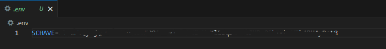
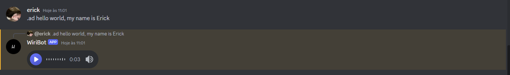

# Text-To-Speech Bot


A simple bot that sends voice messages


## Usage:


First, you'll create a ".env" file where you'll place the Key name as "Schave" followed by your token. Example:




Right, after that, install the library "discord.js" using the command:


```
npm install discord.js
```

After that, run the bot and Voilà!!!, you already have a text-to-speech bot.





[/0.jpg)]([https://www.youtube.com/watch?v=YOUTUBE_VIDEO_ID_HERE](https://www.youtube.com/watch?v=DKeqfRVDmdk))
